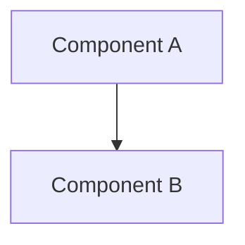

# [SPEC-ID] Feature Name

**Status:** Draft | Approved | Implemented
**Owner:** @username
**Date:** YYYY-MM-DD

## 1. Overview
*Provide a high-level summary of the feature. What is it? Why is it being built? Who is it for?*

## 2. Requirements
### 2.1 Functional Requirements
- [ ] **REQ-001:** The system MUST ...
- [ ] **REQ-002:** The user CAN ...

### 2.2 Non-Functional Requirements
- [ ] Performance: Must render at 60fps.
- [ ] Accessibility: Must pass WCAG AA.

## 3. Technical Design

### 3.1 Architecture
*Describe the components involved. Use Mermaid diagrams if possible.*



### 3.2 Data Model / API
*Define TypeScript interfaces or API schemas.*

```typescript
interface IExample {
  id: string;
  value: number;
}
```

### 3.3 UI/UX
*Reference design files or describe the visual state.*

## 4. Implementation Plan
1.  Step 1
2.  Step 2
3.  Step 3

## 5. Verification
- [ ] Unit Test Cases
- [ ] Visual Regression Criteria
