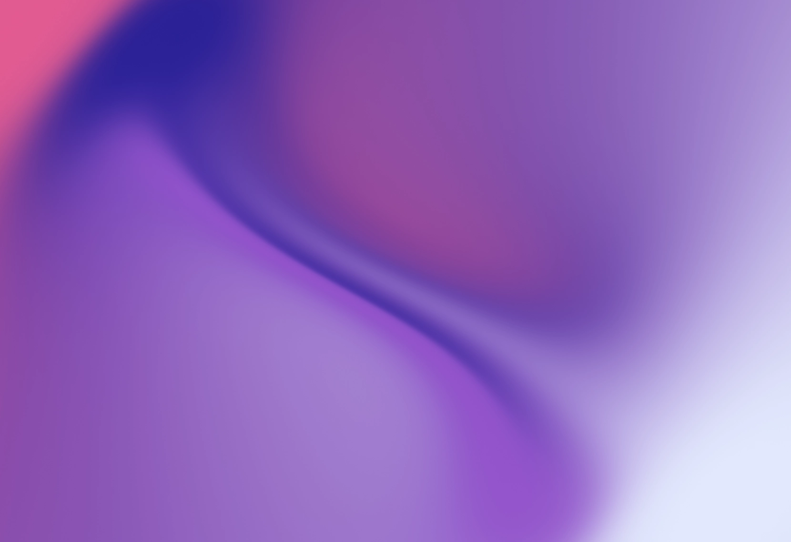

# Paper Shaders



### Getting started

```
// React
npm i @paper-design/shaders-react

// vanilla
npm i @paper-design/shaders

// Please pin your dependency – we will ship breaking changes under 0.0.x versioning
```

### Documentation

[React documentation and interactive examples →](https://shaders.paper.design/)

### React example

```jsx
import {MeshGradient, DotOrbit} from '@paper-design/shaders-react';

<MeshGradient
    colors={['#5100ff', '#00ff80', '#ffcc00', '#ea00ff']}
    distortion={1}
    swirl={0.8}
    speed={0.2}
    style={{width: 200, height: 200}}
/>

<DotOrbit
    colors={['#d2822d', '#0c3b7e', '#b31a57', '#37a066']}
    colorBack={'#000000'}
    scale={0.3}
    style={{width: 200, height: 200}}
/>

// these settings can be configured in code or designed in Paper
```

### Goals:

- Give designers a visual way to use common shaders in their designs
- What you make is directly exportable as lightweight code that works in any codebase

### What it is:

- Zero-dependency HTML canvas shaders that can be installed from npm or designed in Paper
- To be used in websites to add texture as backgrounds or masked with shapes and text
- Animated (or not, your choice) and highly customizable

### Values:

- Very lightweight, maximum performance
- Visual quality
- Abstractions that are easy to play with
- Wide browser and device support

### Framework support:

- Vanilla JS ([@paper-design/shaders](https://www.npmjs.com/package/@paper-design/shaders))
- React JS ([@paper-design/shaders-react](https://www.npmjs.com/package/@paper-design/shaders-react))
- Vue and others: intent to accept community PRs in the future

## Release notes

[View changelog →](./CHANGELOG.md)

## Building and publishing

1. Bump the version numbers as desired manually
2. Use `bun run build` on the top level of the monorepo to build each package
3. Use `bun run publish-all` to publish all (or `bun run publish-all-test` to do a dry run). You can do this even if you just bumped one package version. The others will fail to publish and continue.

## License and use

Paper Shaders uses the PolyForm Shield license. This means the code is free to use in any commercial or non-commercial apps, products, and libraries, as long as they do not compete with Paper or Paper Shaders.

You may NOT use this code in library or in a design tool that competes with Paper or Paper Shaders.

We ask that you link to Paper Shaders if you use this code (it helps us continue investing in this project). Thank you!

[Read the full license →](./LICENSE)

Required Notice: Copyright Lost Coast Labs, Inc. (http://paper.design)
